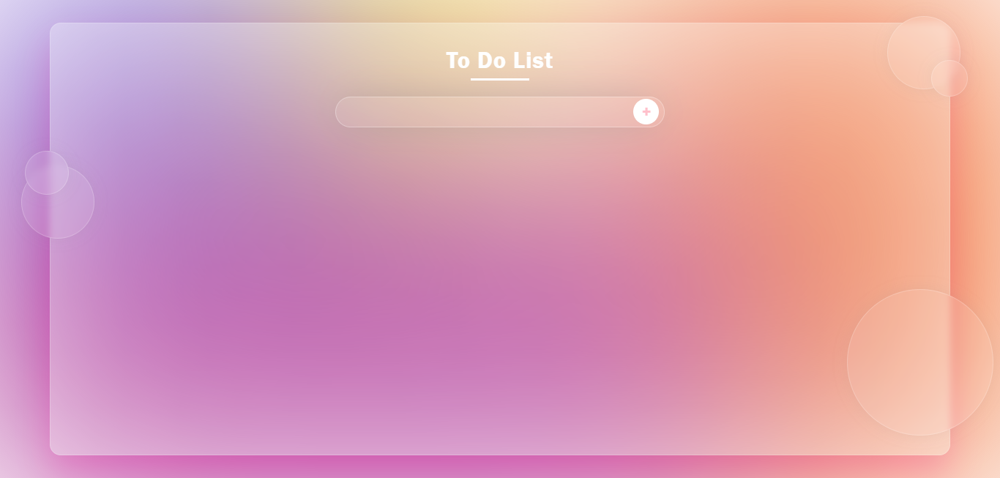

<p align="center"> 
    
</p>

<h1 align="center" id="sobre">🗒 To do List 🗒</h1>

<p align="center" id="descricao">
Basically it consists of a to-do list where the user can add a task, remove it, or edit it.This project was done as one of the exercises in the basic Javascript module of <a href="https://www.gama.academy/">Gama Academy's</a> <code>Hiring Coders</code> training program.
</p>

<p align="center" id="status">
<code>🚀 STATUS: finalizado... 🚀</code>
</p>

<p align="center">
    
    <a href="https://github.com/rodrigsmor/To-do-list/issues">
        
    </a>
    <a href="https://github.com/rodrigsmor/To-do-list/network/members">
        
    </a>
    <a href="https://github.com/rodrigsmor/To-do-list/stargazers">
        
    </a>
</p>

****

# 📚 SUMMARY

- [ℹ️ Sobre](#sobre)
    - [📄 Description](#descricao)
    - [📊 Project Status](#status)
- [⚙️ Resources](#recursos)
- [📽 Demonstration](#demonstracao)
- [🔮 How to visualize](#visualizar)
- [🛠 Technologies used](#tecnologias)
- [🛸 Author](#autor)


# ⚙️ RESOURCES <i id="recursos"> </i>

- [ ] Responsive Layout;
- [x] The User can add a new task;
- [x] The User can change an already added task.
- [x] The User can delete a unwanted task.
- [x] The User can mark a task as marked.

# 📽 DEMONSTRATION <i id="demonstracao"> </i>




# 🔮 HOW TO VISUALIZE <i id="visualizar"> </i>

- You can visualize the project accessing the following <a>link</a>.

- In case of want to see the project in your own machine, execute on your local terminal the next commands to clone the repository in your personal computer.

````
# create a local clone of repository
$ git clone https://github.com/rodrigsmor/To-do-list.git

# open the directory
$ cd To-do-list
````

# 🛠️ TECHNOLOGIES USED <i id="tecnologias"> </i>


# 🛸 AUTHOR <i id="autor"> </i>


### Rodrigo Moreira 🎆
🌐 Developed by [ME 👨🏽‍💻](https://github.com/rodrigsmor)

[](https://twitter.com/psrodrigs)
[](https://www.linkedin.com/in/rodrigo-m0reira-da-silva/)# To-do-list
